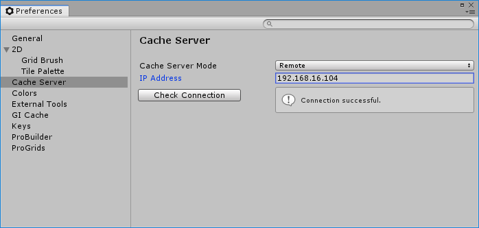
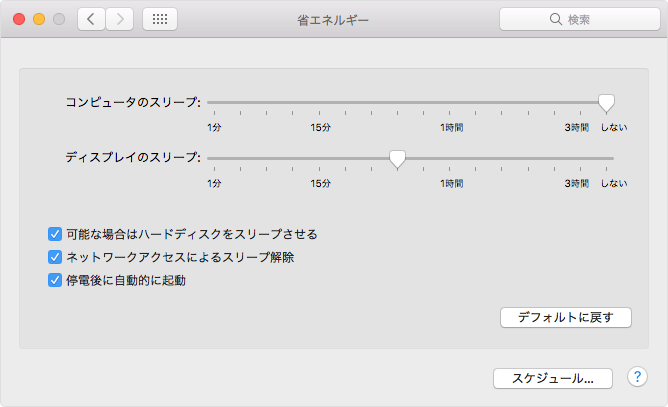

# Unityキャッシュサーバーの設定

<div style="text-align: right;">
2019年8月26日<br>
株式会社アルファオメガ  松本清明
</div>

## 目次
- [Unityキャッシュサーバーの設定](#Unityキャッシュサーバーの設定)
	- [目次](#目次)
	- [はじめに](#はじめに)
	- [Unityでキャッシュサーバーを登録する](#Unityでキャッシュサーバーを登録する)
- [Unityのキャッシュサーバー導入手順](#Unityのキャッシュサーバー導入手順)
	- [インストール](#インストール)
		- [Homebrewのインストール](#Homebrewのインストール)
		- [Nodebrewのインストール](#Nodebrewのインストール)
		- [Node.jsのインストール](#Node.jsのインストール)
		- [キャッシュサーバーのインストール](#キャッシュサーバーのインストール)
	- [起動スクリプトを準備](#起動スクリプトを準備)
		- [シェルスクリプトを作成](#シェルスクリプトを作成)
		- [rootで実行できるパーミッションを設定](#rootで実行できるパーミッションを設定)
	- [LaunchDemonsの登録](#LaunchDemonsの登録)
		- [CacheServer.plistを作成](#CacheServer.plistを作成)
		- [plistのオーナーをrootに変更](#plistのオーナーをrootに変更)
		- [ファイルの内容の確認](#ファイルの内容の確認)
	- [Macの設定](#Macの設定)
		- [動作開始](#動作開始)
		- [Macのポート解放](#Macのポート解放)
		- [Macの省電力モード設定](#Macの省電力モード設定)
		- [Mac再起動](#Mac再起動)

## はじめに
[Unityキャッシュサーバー](https://docs.unity3d.com/ja/2019.1/Manual/CacheServer.html)は作業者のPCでインポートされたアセットをキャッシュサーバーにキャッシュすることによりアセットのインポートにかかる時間を著しく短くすることが可能となっています。
なるべくたくさんの作業者がサーバーに接続してインポートアセットを共有してインポート時間を稼ぐようにしましょう！

## Unityでキャッシュサーバーを登録する

社内のMacMiniにUnity キャッシュサーバーを設定してみましたので作業で使用しているUnityに設定してみて下さい。

1. Unityのメニューの[Edit]-[Preferences...]を選んでPreferences画面を表示して下さい。
1. IP Address に 192.168.16.104を設定してリターンキーを押して下さい。
1. Check Connectionボタンを押して下さい。
1. 画面の様に Connection successful.が表示されれば接続成功です。


※ これはUnity 2018.3.14f1 (64-bit)の画面です。

___

# Unityのキャッシュサーバー導入手順

どのようにインストールしたかの手順を書いておきます。別にサーバーを立てる時や不具合が発生した場合に役立てて下さい。デーモンで動かすようにしているのでMacが起動していればサーバーとして稼働しています。

## インストール
GitHubで[Cache Server](https://github.com/Unity-Technologies/unity-cache-server)のプログラムが公開されています。README.mdの[Server Setup](https://github.com/Unity-Technologies/unity-cache-server#server-setup)を順番に行って下さい。
読めば書いてありますがNode.jsが必要です。
またnpmを使用するのでインストールしていない場合は Homebrewのインストールから行って下さい。
ここでは自分が行って記述が足りなことや具体的な設定例を書いておきます。

### Homebrewのインストール

``` bash
$ /usr/bin/ruby -e "$(curl -fsSL https://raw.githubusercontent.com/Homebrew/install/master/install)"
```

### Nodebrewのインストール

``` bash
$ brew install nodebrew
```

### Node.jsのインストール
``` bash
$ nodebrew install-binary latest
```

※ Warning: Failed to create the fileが表示された場合は以下のコマンドを実行して、再度インストールのコマンドを実行。

``` bash
$ mkdir -p ~/.nodebrew/src
```

インストール中で使用できるバージョンをの確認します。
``` bash
$ nodebrew list
```

[README.md](https://github.com/Unity-Technologies/unity-cache-server#server-setup)には version 10.15.xとあるのでそれに近い値バージョンをカレントとして設定します。
``` bash
$ nodebrew use v10.15.3
```
※ 2019年8月26日現在はこれ

### キャッシュサーバーのインストール
GitHubのソースコードからキャッシュサーバーのインストールします。
```Bash
$ npm install github:Unity-Technologies/unity-cache-server -g
```
※最新版のCache Server v6.4をインストールするにはソースコードからのインストールをしないとうまくかなかったので、ソースコードからインストールすることにしました。

## 起動スクリプトを準備

### シェルスクリプトを作成

``` bash
vim /User/matsmoto/com.unity3d.CacheServer.sh
```
ファイルの内容
``` bash
#!/bin/sh
export PATH=/usr/local/bin:/Users/matsumoto/bin/packer:/Users/matsumoto/.nodebrew/current/bin:$PATH
unity-cache-server --cache-module cache_ram
```
### rootで実行できるパーミッションを設定
```Bash
chmod 447 com.unity3d.CacheServer.sh
```

## LaunchDemonsの登録

### CacheServer.plistを作成
```Bash
sudo vim /Library/LaunchDemons/com.unity3d.CacheServer.plist
```

ファイルの内容
```XML
<?xml version="1.0" encoding="UTF-8"?>
<!DOCTYPE plist PUBLIC "-//Apple//DTD PLIST 1.0//EN" "http://www.apple.com/DTDs/PropertyList-1.0.dtd">
<plist version="1.0">
  <dict>
      <key>Label</key>
      <string>com.unity3d.CacheServer</string>
      <key>ProgramArguments</key>
      <array>
          <string>/Users/matsumoto/com.unity3d.CacheServer.sh</string>
      </array>
      <key>KeepAlive</key>
      <dict>
          <key>SuccessfulExit</key>
          <false/>
      </dict>
      <key>RunAtLoad</key>
      <true/>
      <key>StandardOutPath</key>
      <string>/tmp/com.unity3d.CacheServer.out</string>
      <key>StandardErrorPath</key>
      <string>/tmp/com.unity3d.CacheServer.err</string>
  </dict>
</plist>
```
### plistのオーナーをrootに変更
``` Bash
$ sudo chown root /Library/LaunchDemons/com.unity3d.CacheServer.plist
```

### ファイルの内容の確認
以下のコマンドで plistを正しく記述できているか確認ができます。OKが出ることを確認して下さい。
``` Bash
$ plutil -lint /Library/LaunchDemons/com.unity3d.CacheServer.plist
com.unity3d.CacheServer.plist: OK
```

### 動作開始
``` Bash
$ sudo launchctl load /Library/LaunchDemons/com.unity3d.CacheServer.plist
```

plistで設定したパスの/tmp/com.unity3d.CacheServer.errにエラーがあれば出力していますので、エラーが出ていないことを確認してください。エラーが発生していれば現認を調べ修正してください。

## Macの設定

### Macのポート解放
キャッシュサーバーのデフォルトは 8126 なのでサーバーに使用すると時はポートを開放して下さい。

### Macの省電力モード設定
Macをキャッシュサーバーとして使用するので使用していないとスリープモードになりキャッシュサーバーが反応しなくなる時があります。コンピューターのスリープをしないに設定しました。

エネルギー関連の設定は、システム環境設定の「省エネルギー」パネルで調整できます。
1. Apple メニュー >「システム環境設定」を選択します。
1. 「省エネルギー」をクリックします。
1. コンピュータのスリープをしないに変更。


※本当はネットワークアクセスによるスリープ解除が働いてスリープが解除してくれればスリープも許可したいのですがうまく動作しませんでした。

### Mac再起動
設定が完了したら一度再起動しサーバーが自動で起動しているか確認してください。
上記のUnityEditorでのサーバーが動作しているかで確認できます。
