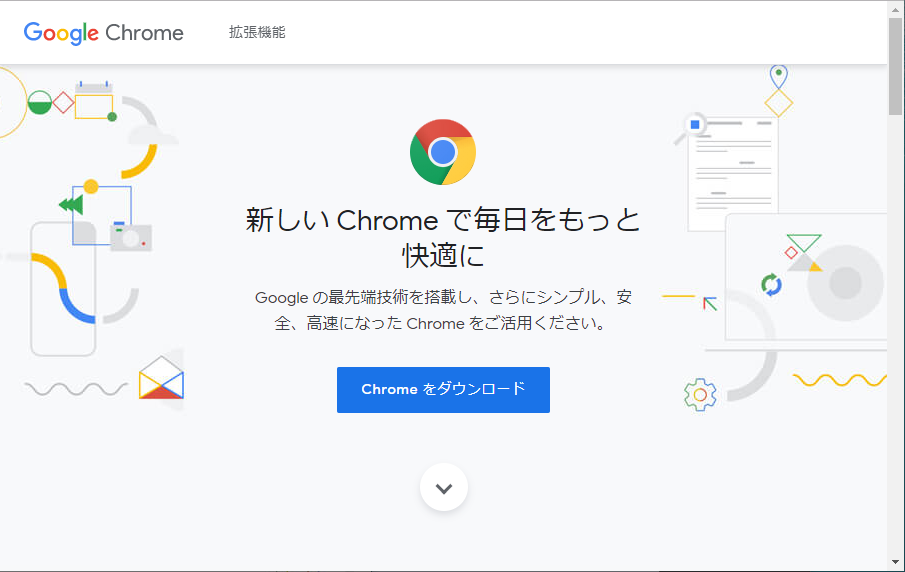
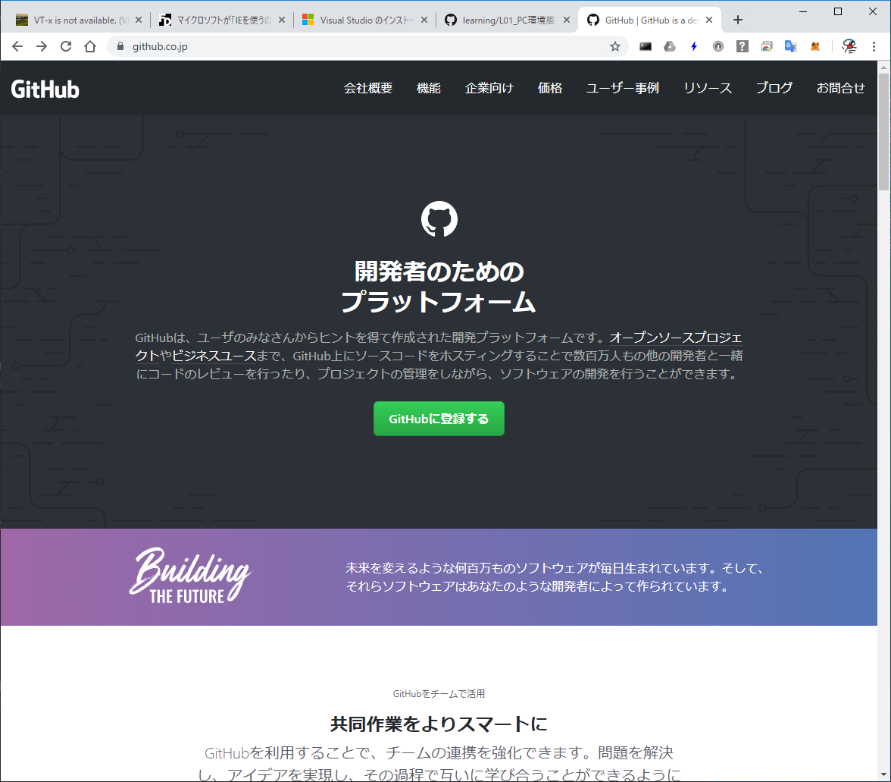
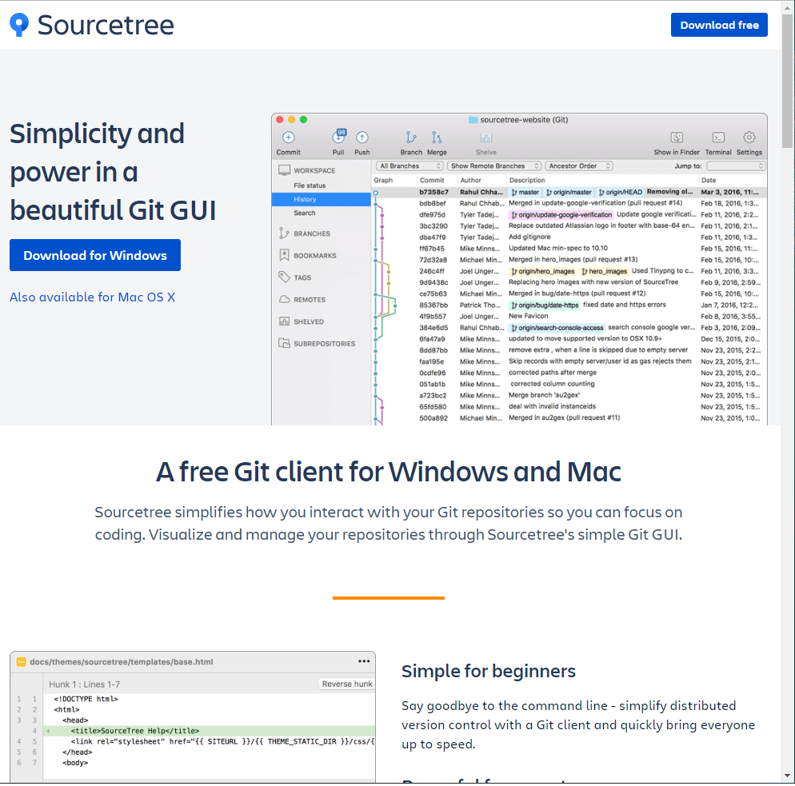
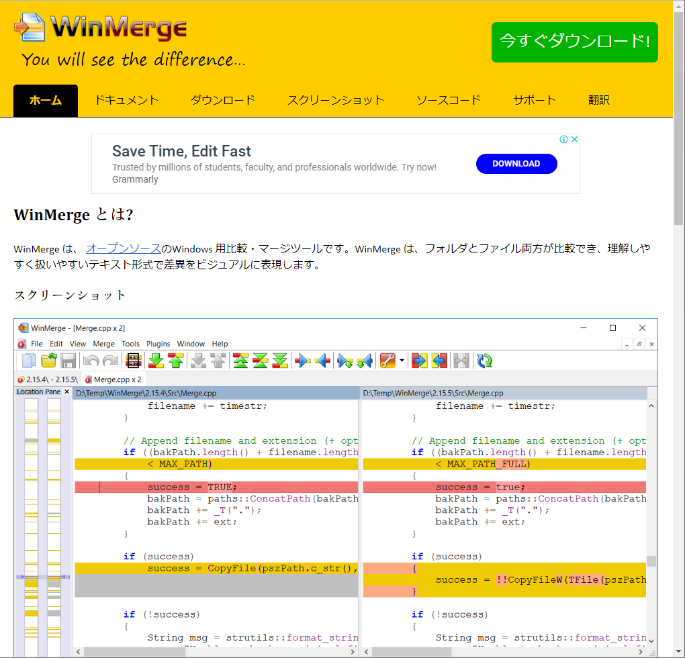
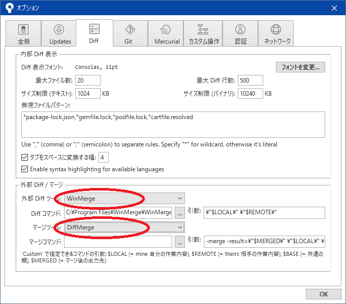
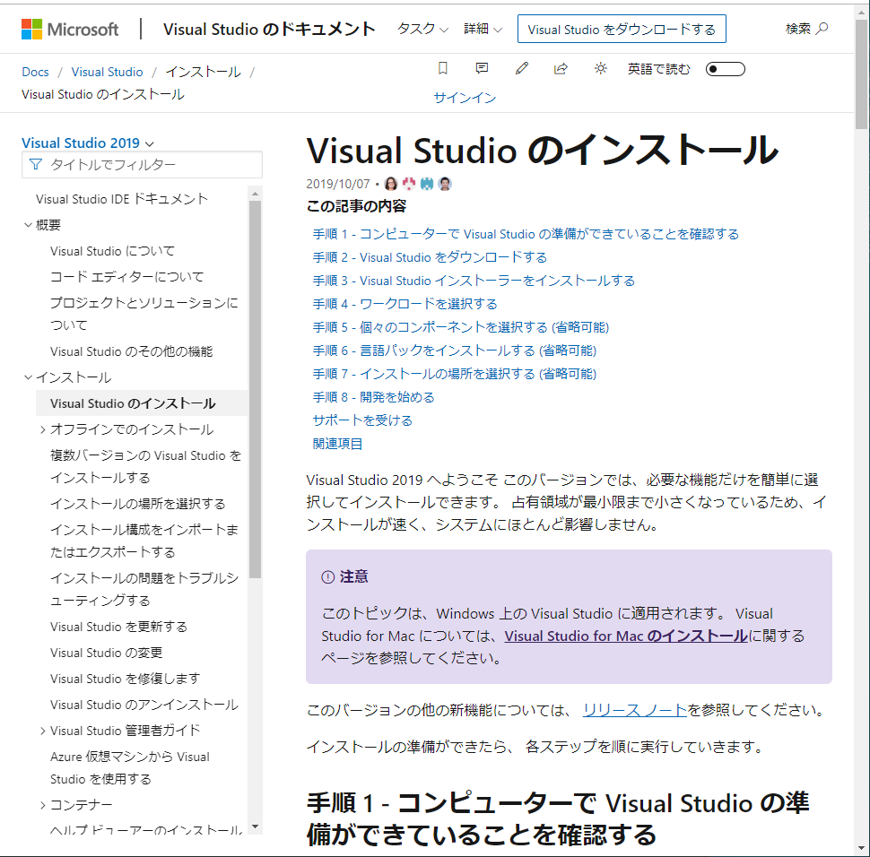
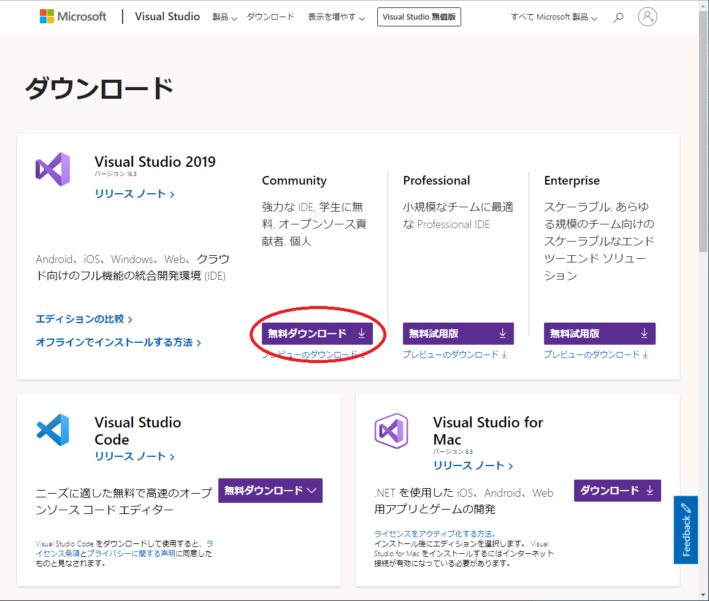
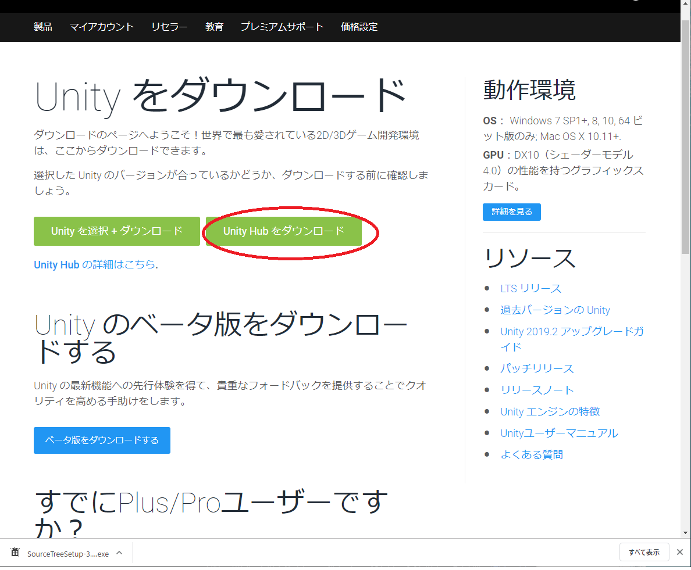

# PC環境構築

2019年10月14日 
株式会社アルファオメガ  松本清明

## はじめに
SEPブートキャンプで使用するソフトウェアのインストールやユーザー作成の設定を行ってください。
これ以外でも必要とするソフトはあるかと思いますが、別の授業でインストールをしているかもしれないので省略致します。

## インターネットブラウザ
Windowsパソコンを使用していると標準でインストールされている Microsoft Internet エクスプローラーや又は Microsoft Edgeを使用している方は多いと思います。インターネットエクスプローラーは開発や終了していますしEdgeを推奨しているので、新しいパソコンを設定した場合などでメインでインターネットエクスプローラー11を使用するのは避けましょう。

何が良いか好みもあると思いますが、[Google Chrome ウェブブラウザ](https://www.google.com/intl/ja_jp/chrome/) をお勧めしておきます。

Chromeはプログラマに便利な開発に必要な機能も豊富でとても便利です。
マルチプラットフォームデバイスで開発人たちはWindows環境で iOS/Androidの端末にエミュレータして画面の確認をすることもできます。

## GitHub
GitHubは Gitのリポジトリを利用できる有名なサービスです。作成したプログラムを世界中に公開するのに便利なことや複数のプログラマと共同で作業する場合にとても便利なサイトとなっています。Gitを使用するのに必ずしもGitHubが必要ではありませんが、プロ黒グラムを共有や公開するのに便利な仕組みとなっていますので利用しましょう。
今回の授業で作成したプログラムはGitHub(Git)にコミットしてもらいプログラムを確認させてもらいます。

## SourceTree

Gitクライアントソフトで有名な[SourceTree](https://www.sourcetreeapp.com/)をインストールします。

[Gitクライアント! SourceTree の使い方 ～GUIでGitを使おう～ | バージョン管理システム入門(初心者向け)](https://tracpath.com/bootcamp/learning_git_sourcetree.html)のページがインストール手順としてわかりやすかったので参考にしてみてください。

## WinMerge
WinMergeはファイルの差分を視覚的に確認するツールです。ソースコードの変更点などを確認するのにとても便利なので[WinMergeのサイト](https://winmerge.org/)からダウンロードして使用してみてください。

### SourctTreeとの連携
SourctTree のメニュー[ツール]-[オプション]でオプションダイアログを開いてDiffのページを開くとWinMergeに変更する項目があります。WinMergeをインストールした場合は変更すると便利なので使用してみて下さい。

## Visual Stdio Community 2019

[以下のページから](https://docs.microsoft.com/ja-jp/visualstudio/install/install-visual-studio?view=vs-2019) Visual Stduio Community 2019のインストール手順通りに作業して下さい。

以下の画面でCommunityを選択してください。

## Unity Hub と Unity2019

UnityHubとはUnity様々なバージョンのインストールを管理するのに便利なツールです。Unityは頻繁にバージョンアップされていくので、バージョンを管理する意味でも[Unity をダウンロード](https://unity3d.com/jp/get-unity/download)からUnityHubをインストールしてUnityのインストール／アンインストールの管理をするのをお勧めします。

