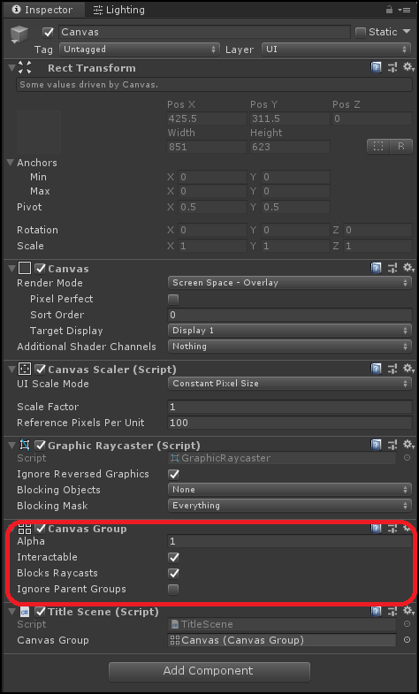
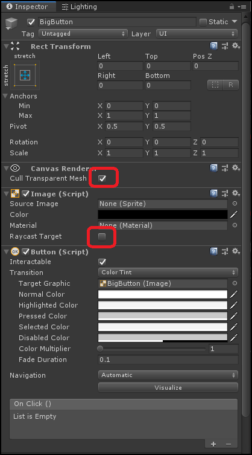

# Unityの使い方

<div style="text-align: right;">
2019年11月16日<br>
株式会社アルファオメガ  松本清明
</div>


## シーン遷移

ゲームを作る場合に色々な画面があると思います。
タイトル、メイン画面、オプション画面、ゲーム画面など色々な画面のボタンを押して
別の画面に遷移してゲームが構成されていると思います。

Unityでゲームを作っていく場合は画面単位にScene(.unity)を用意してそれを移動してゲームを構築していきます。
以下の様にタイトル画面とメイン画面のスクリプトを用意して行き来します。

TitleScene.cs
```cs
using System.Collections;
using System.Collections.Generic;
using UnityEngine;
using UnityEngine.SceneManagement;

public class TitleScene : MonoBehaviour
{
    [SerializeField]
    private CanvasGroup canvasGroup;

    // Start is called before the first frame update
    void Start()
    {
    }

    // Update is called once per frame
    void Update()
    {
    }
    public void OnButtonClick()
    {
        StartCoroutine( ExecuteChangeScene("MainScene"));
    }
    IEnumerator ExecuteChangeScene(string sceneName)
    {
        while (canvasGroup.alpha>0)
        {
            canvasGroup.alpha -= Time.deltaTime;
            yield return null;
        }
        canvasGroup.alpha = 0;

        SceneManager.LoadScene(sceneName);
        yield break;
    }
}
```
MainScene.cs
```cs
using System.Collections;
using System.Collections.Generic;
using UnityEngine;
using UnityEngine.SceneManagement;

public class MainScene : MonoBehaviour
{
    [SerializeField]
    private CanvasGroup canvasGroup;

    void Start()
    {
    }
    void Update()
    {
    }

    public void OnButtonClick()
    {
        StartCoroutine(ExecuteChangeScene("TitleScene"));
    }
    IEnumerator ExecuteChangeScene(string sceneName)
    {
        while (canvasGroup.alpha > 0)
        {
            canvasGroup.alpha -= Time.deltaTime;
            yield return null;
        }
        canvasGroup.alpha = 0;

        SceneManager.LoadScene(sceneName);
        yield break;
    }
}
```

## CanvasGroup
CanvasGroupというコンポーネントがあり、これを使用するとキャンバス全体のAlpha値をコントロールすることが出来ます。例えば上の例だと画面遷移のフェードアウトに使用しています。



## BigButton
ボタンを連打した場合に何回も入力を受け付けてしまい誤動作を起こしてしまう場合があります。
今までのプログラムは連打すると都合が悪い作りとなっています。




## スクリーンフェード

## TextMeshProでタイトル名を表示

## TextMesh ProでDynamic SDF Systemで文字を出す。

1. `Window>TextMeshPro>FontAssetCreator`で`FontFontAsset`を作成
1. FontAssetを選択
1. Generation Settingsの項目を埋める
```
   Source Font Fileに、フォントファイル（otf等）を指定
   Atlas Population ModelをDynamicに変更
   Atlas Render ModeはSDF AA
  Sample Point Sizeは60前後にしておく
  （文字の解像度に依存、大きいとフォントがすぐ一杯になる）
  Atlas Wideth、Atlas Heightは少し大きめにする
  （文字を表示出来る量に依存、小さいとすぐ一杯になる）
```
1. Applyを押す

http://tsubakit1.hateblo.jp/entry/2019/02/02/060758


  使い方の手順を書く
　日本語を出すには？
  縁取りの方法

## ダイナミックフォントとビットマップフォント
