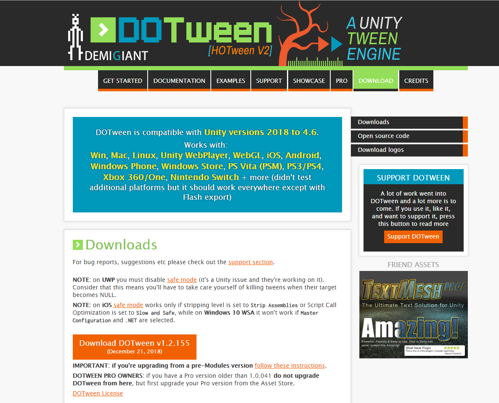
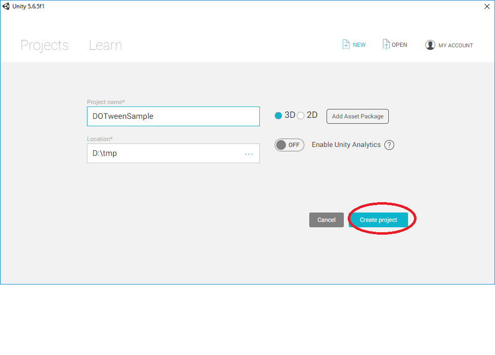
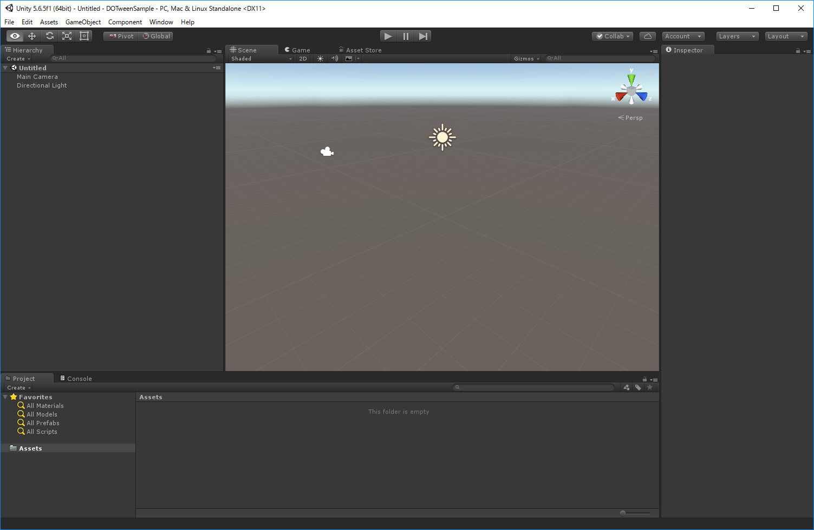
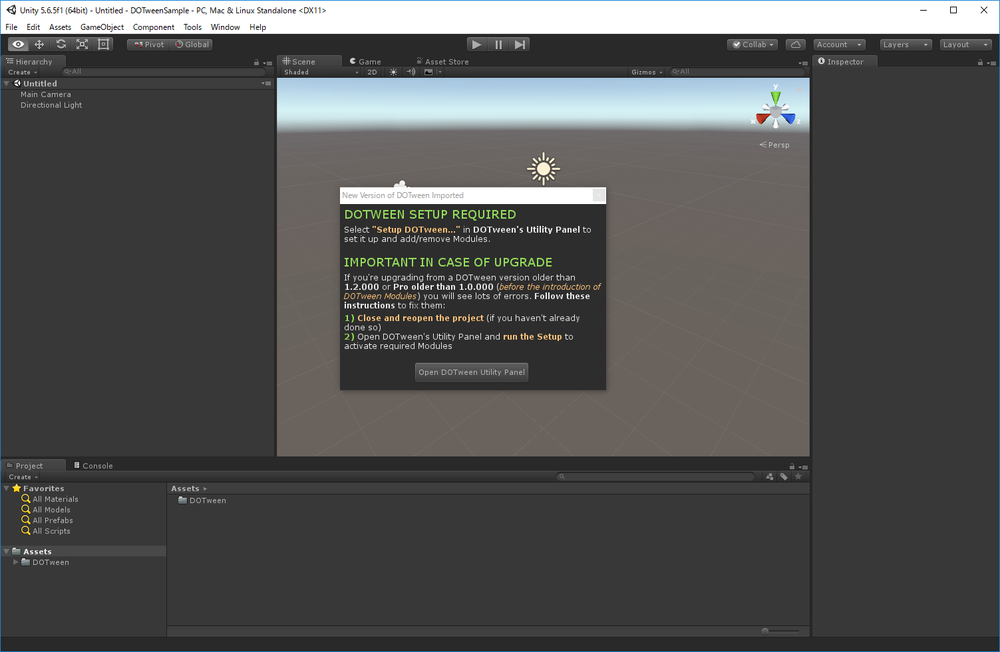
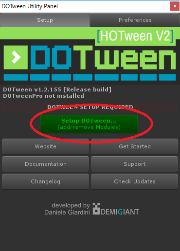
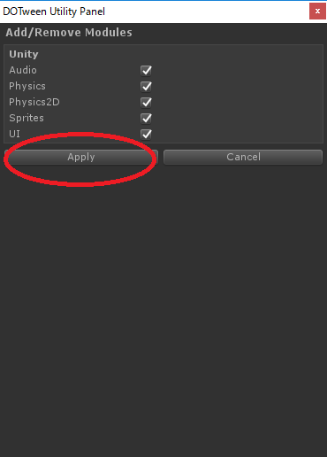
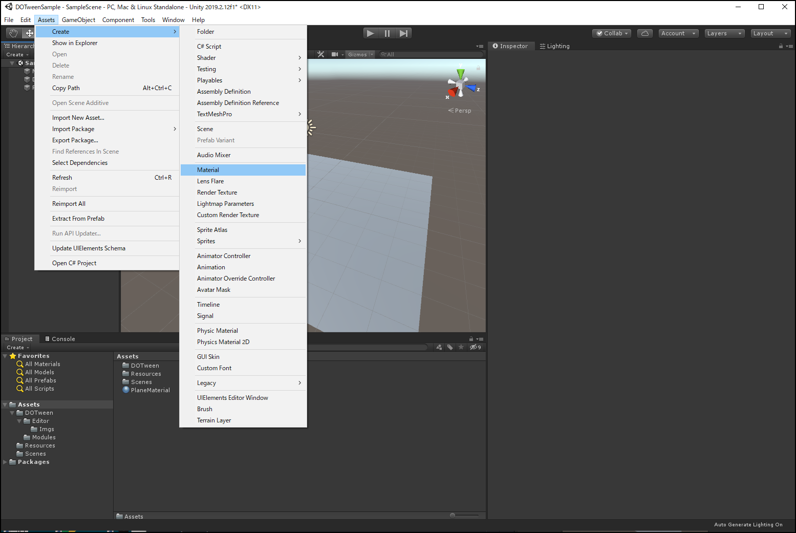
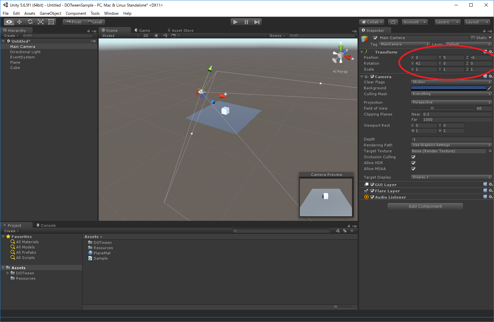
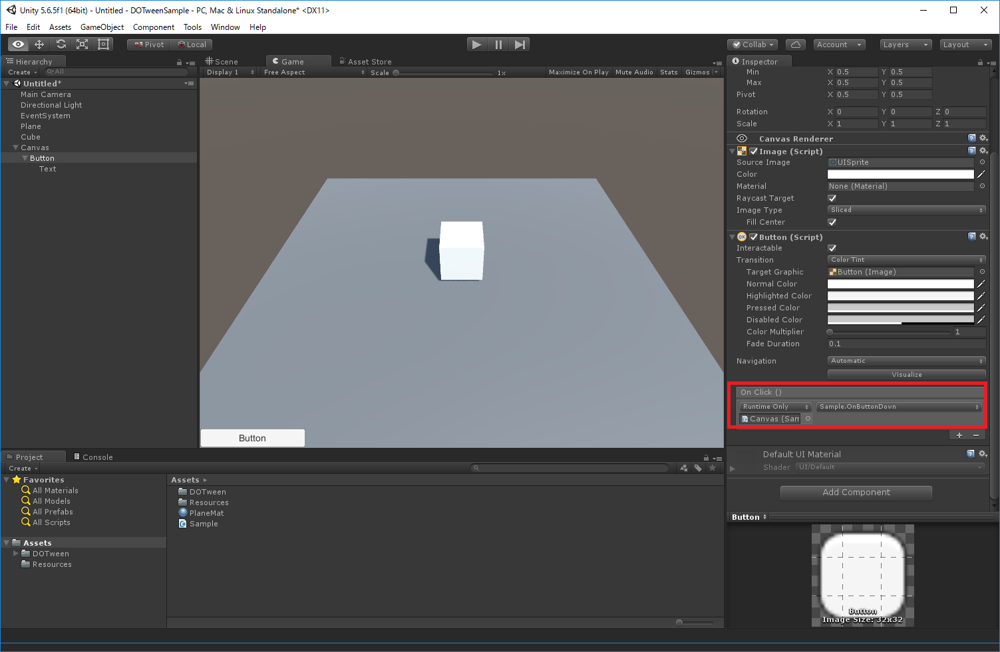

# DOTweenを使用してみよう
<div style="text-align: right;">
2019年11月13日<br>
株式会社アルファオメガ  松本清明
</div>


# DOTweenのインストール

## DOTween 公式サイト


[DOTween公式サイト](http://dotween.demigiant.com/)

## DOTween アセットのダウンロード



[Downloadサイトのリンク](http://dotween.demigiant.com/download.php/)

最新版 v1.2.305(2019/11/13現在)です。
DOTween_1_2_305.zipをダウンロードしてくだください。
又はダウンロードしてコピーしてありますので使用してください。

## インストール方法

## 新規プロジェクトをつくります


## Unityの起動画面


### DOTween_1_2_305.zipの解凍
- DOTween_1_2_305.zipを展開して出てきたDOTweenフォルダーをUnityプロジェクトの Assetsにコピーします。

### Unityにインポート

- 以下のダイアログが表示されます。


- Open DOTween Unity Panelボタンを押します。

### DOTween Unity Panel ダイアログ

- 緑のボタンのSetup DOTween...を押します。


### DOTween Unity Panel ダイアログ

- Applyを押します。
これでDOTweenが使用できるようになりました。


# DOTweenを使用してみよう

## シーンを作成

### Plane GameObjectを配置
### Plane のマテリアルを変更
### cube GameObjectを配置
### Cameraを変更



- 確認しやすいようにカメラを変更します。

例)

|パラメータ|X|Y|Z|
|:--|:--|:--|:--|
|Postion|0|5|-6|
|Rotation|42|0|0|
|Scale|1|1|1|

## Sample.csを作成
Sample.cs
```
using System.Collections;
using System.Collections.Generic;
using UnityEngine;
using DG.Tweening;

public class Sample : MonoBehaviour {

	[SerializeField]
	GameObject CubeGameObject;

	// Use this for initialization
	void Start () {

	}

	// Update is called once per frame
	void Update () {

	}

	public void OnButtonDown()
	{
		this.CubeGameObject.transform.DOMove(new Vector3(3.0f, 0.5f, 0), 2.0f);
	}
}
```

## Canvasにsample.csスクリプトを割り当てる

- 画像の赤の部分の様にCube GameObject のインスタンを設定します。


## ボタンに関数を割り当てる



- 画像の赤の部分の様にCanvasのオブジェクトを割り当ててSample.OnButtonDown関数を設定します。


# 最後に
色々なTweenがありますので、改造して色々な動きを作ってみて下さい。
