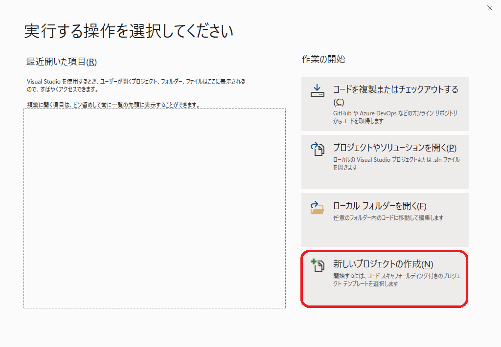
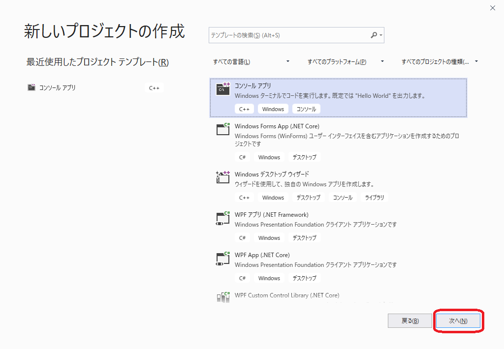
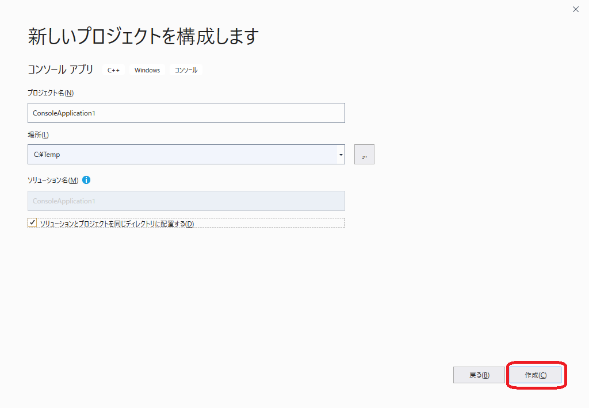
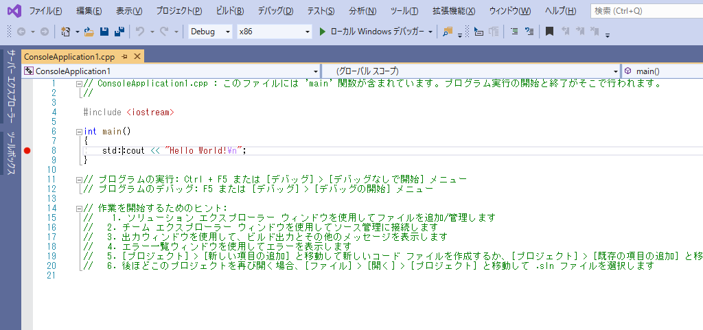
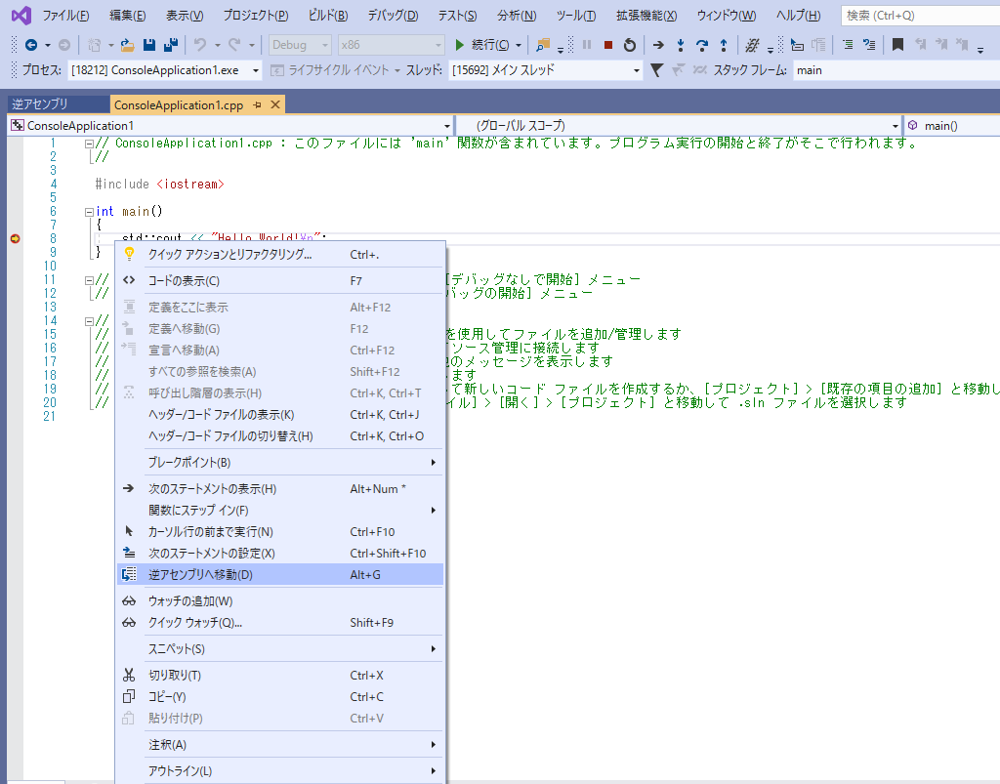
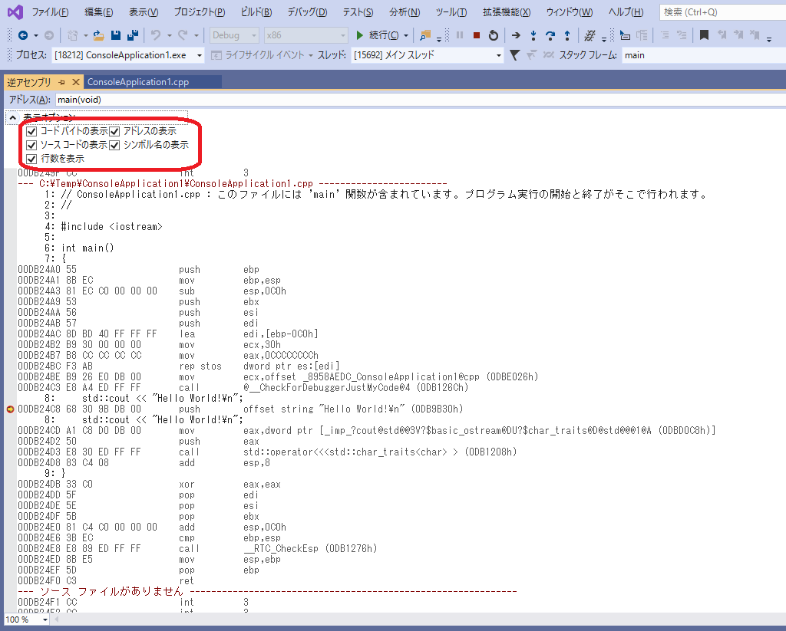
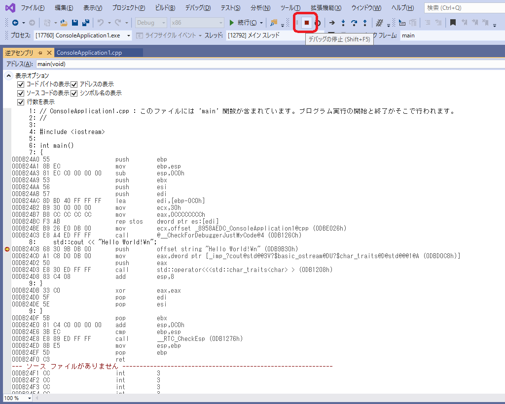
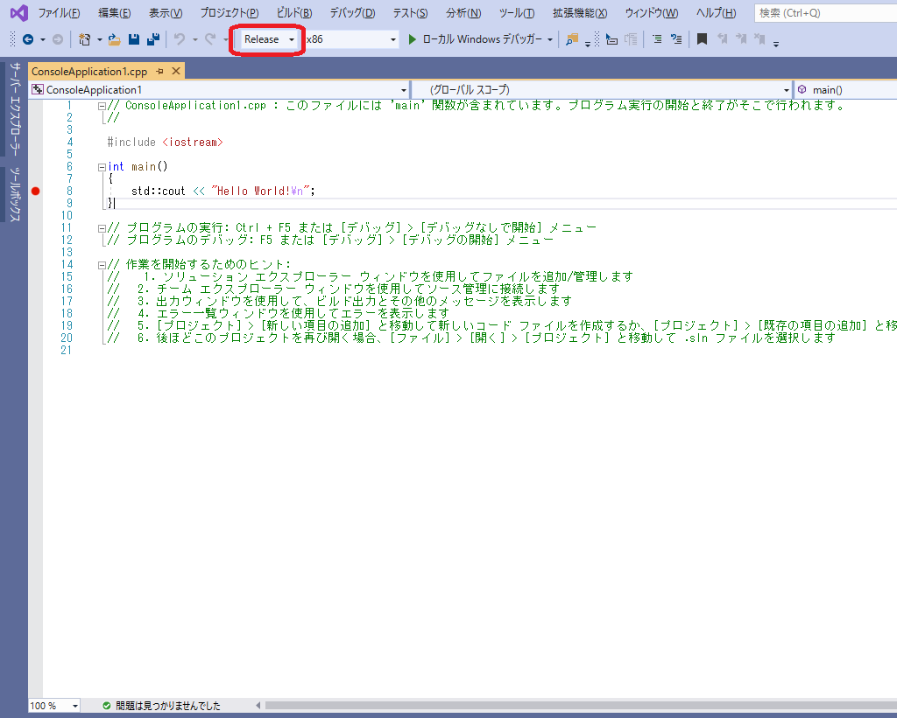

# 機械語入門

## コンピュータ用語

### n進数
コンピュータープログラムをしていると１つの数字を２進数、１０進数、１６進数と様々な表現で表すことがあります。ここで整理しておきましょう。

### ２進数
コンピュータの数値の最小単位をビットと言い、０と１の２つのみの数字で表します。
コンピュータの容量を表すときにメインメモリー,HDD,CD/DVDなど多くの場合はバイト （bytes) の単位を使用しますが、 ROMなどの場合はビットで表します。読み書きできる最小の単位で決まります。

### １０進数
０から９までの数字を使用して１つの桁を表します。通常一般的によく使用する数値表現です。

### １６進数

#### ニブル
あまり最近では聞かないのですがニブルという用語があり４ビット単位に区切ります。

|8の桁|4の桁|2の桁|1の桁|
|---|---|---|---|
|1|1|0|0|

8 + 4= 12 (0xc)

|8の桁|4の桁|2の桁|1の桁|
|---|---|---|---|
|1|1|1|1|

8 + 4 + 2 + 1 = 15 (0xf)

#### 0x00 のビットイメージ
|bit7|bit6|bit5|bit4||bit3|bit2|bit1|bit0|
|---|---|---|---|---|---|---|---|---|
|0|0|0|0||0|0|0|0|

ビットをニブル単位(4つに)区切って考えると計算しやすくなります。
上位の4bitは0 下位の4bitは0なので 0x00となります。

#### 0xa5 のビットイメージ
|bit7|bit6|bit5|bit4||bit3|bit2|bit1|bit0|
|---|---|---|---|---|---|---|---|---|
|1|0|1|0||0|1|0|1|

上位の4bitは10で16進数では0xa、下位の4bitは5なので 0xa5となります。

#### 0xff のビットイメージ
|bit7|bit6|bit5|bit4||bit3|bit2|bit1|bit0|
|---|---|---|---|---|---|---|---|---|
|1|1|1|1||1|1|1|1|

上位の4bitは 8 + 4 + 2 + 1 = 15 (0xf)
下位の4bitも 8 + 4 + 2 + 1 = 15 (0xf) なので
10進数では255で16進数では0xFFとなります。

#### １Bytesでbit7が符号ありとなしの場合
コンピュータで扱う整数は符号あり、なしの概念があり、整数の表し方が変わります。
１バイトを粟ラス場合に0xffだとすとろ符号なし整数では255ですが、符号ありだと-1になります。
これを２の歩数表現といいます。

|16進数|10進数(符号なし)|10進数(符号あり)|
|---|---|---|
|0x0|0|0|
|0x1|1|1|
|0x2|2|2|
|0x3|3|3|
|0x7F|127|127|
|0x80|128|-128|
|0x81|129|-127|
|0x82|130|-126|
|0x83|131|-125|
|0xFC|252|-4|
|0xFD|253|-3|
|0xFE|254|-2|
|0xFF|255|-1|

## ハードウェア

## CPU

### 80386のレジスタ

|レジスタ|意味 |
|---|---|
|EAX|アキュムレータレジスタ  |
|EBX|ベースレジスタ  |
|ECX|カウンタレジスタ  |
|EDX|データレジスタ  |
|ESP|スタックポインターレジスタ  |
|ESI|ソースレジスタ  |
|EDI|デスティネーションレジスタ  |
|EFLAGS|フラグレジスタ  |

### EFLAGレジスタの31～24ビット
|31|30|29|28|27|26|25|24|
|---|---|---|---|---|---|---|---|
| 0| 0| 0| 0| 0| 0| 0| 0|

### EFLAGレジスタの23～16ビット
|23|22|21|20|19|18|17|16|
|---|---|---|---|---|---|---|---|
| 0| 0|ID|VIP|VIF|AC|VM|RF|

### EFLAGレジスタの15～8ビット
|15|14|13|12|11|10|9|8|
|---|---|---|---|---|---|---|---|
| 0|NT|IOPL||OF|DF|IF|TF|

### EFLAGレジスタの7～0ビット
|7|6|5|4|3|2|1|0|
|---|---|---|---|---|---|---|---|
|SF|ZF| 0|AF| 0|PF| 1|CF|


### EFLAGレジスタの重要なbit
|bit|意味|
|---|---|
|0|CF : キャリーフラグ。最後の算術演算操作で加算においてレジスタの大きさを越えてビットのキャリー（桁上がり）かボロー（桁借り）をした場合にセットされる。これは、キャリーの生じた加算やボローの生じた減算の次の操作がされた場合に、1個のレジスタだけ扱うことのできる値であるか確認するのに使われる。|
|2|PF : パリティフラグ。結果の最下位バイトに値1 のビットが偶数個含まれている場合にセットされ、奇数個の場合にはクリアされる。|
|6|ZF : ゼロフラグ。操作の結果がゼロ (0) になった場合にセットされる。|
|7|SF : 符号フラグ。操作の結果が負となった場合にセットされる。|

その他は省略します。

参考RUL

[X86アセンブラ/x86アーキテクチャ - Wikibooks](https://ja.wikibooks.org/wiki/X86%E3%82%A2%E3%82%BB%E3%83%B3%E3%83%96%E3%83%A9/x86%E3%82%A2%E3%83%BC%E3%82%AD%E3%83%86%E3%82%AF%E3%83%81%E3%83%A3)

## メモリー

### アドレス
- メモリーはアドレスが割り振られている。

１つのアドレスに１バイトの数字が保存できる。 アドレスは0x00000000～0xFFFFFFFFで4294967296番地で4Gbyte分の数字を格納できることになる。

|アドレス|+15|+14|+13|+12|+11|+10|+9|+8|+7|+6|+5|+4|+3|+2|+1|+0|
|---|---|---|---|---|---|---|---|---|---|---|---|---|---|---|---|---|
|0x0000000|00|00|00|00|00|00|00|00|00|00|00|00|00|00|00|00|
|0x0000010|00|00|00|00|00|00|00|00|00|00|00|00|00|00|00|00|
|0x0000020|00|00|00|00|00|00|00|00|00|00|00|00|00|00|00|00|
|0x0000030|00|00|00|00|00|00|00|00|00|00|00|00|00|00|00|00|
|0x0000040|00|00|00|00|00|00|00|00|00|00|00|00|00|00|00|00|
|0x0000050|00|00|00|00|00|00|00|00|00|00|00|00|00|00|00|00|
|0x0000060|00|00|00|00|00|00|00|00|00|00|00|00|00|00|00|00|
|0x0000070|00|00|00|00|00|00|00|00|00|00|00|00|00|00|00|00|


## 命令表

|コード|名前|意味|
|---|---|---|
|00|add||
|03 FF|add edi,edi||
|08|or||
|10|adr||
|18|sbb||
|20|and||
|28|sub||
|30|xor||
|33 C0|xor eax,eax|eaxレジスタに０を代入する|  
|33 C1|||  
|33 D2|xor edx,edx|edxレジスタに０を代入する|  
|3B C2|cmp eax,edx|eaxとedxを比較する|
|3B EC|cmp ebp,esp|ebpとespを比較する|  
|40|inc|レジスタの内容を＋１する|
|42|inc edx|edxレジスタの内容を＋１する|  
|48|dec|レジスタの内容をー１する|
|4D|dec ebp|ebpレジスタの内容をー１する|
|50|push eax|eaxレジスタをスタックにpushする|  
|53|push ebx|ebxレジスタをスタックにpushする|
|54|push esp||
|55|push ebp||
|56|push esi||
|57|push edi||
|5B|pop ebx||  
|5C|||
|5D|pop ebp||  
|5E|pop esi||  
|5F|pop edi||  
|68 ?? ?? ?? ??|push $????????||
|7E ??|jle $??||
|7F ??|jg $??||  
|81 C4 ??|add esp,$??||  
|83 C4 ??|add esp,??||  
|85 C0|test eax,eax||
|8B 01|mov eax,dword ptr [ecx]||
|8B 40 ??|mov eax,dword ptr [eax+$??]||
|8B C8|mov ecx,eax||
|8B CE|mov ecx,esi||  
|8B E5|mov esp,ebp||
|8B EC|mov ebp,esp||  
|8B F0|mov esi,eax||  
|8D BD ?? ?? ?? ??|lea edi,$????????||  
|90|nop|何もしない|  
|A0|mov al||  
|B8 ?? ?? ?? ??|mov eax,$????????||
|B9 ?? ?? ?? ??|mov ecx,$????????||
|BA ?? ?? ?? ??|mov edx,$????????||
|BF ?? ?? ?? ??|mov edi,1$????????||
|C3|ret||  
|D1| shl dword ptr [ebp-8],1||  
|D1 FF|sar edi,1||
|E0|loopnz ecx|ecxをー１して０以外だったらPCを移動する|  
|E8 ?? ?? ?? ??|call $????????||
|E9|jmp $????????||
|FF 10|call dword ptr [eax]||

 #### 参考URL

[coder32 edition | X86 Opcode and Instruction Reference 1.12](http://ref.x86asm.net/coder32.html)


### load / store

### 演算
  - 加減算
  - 比較
  - シフト命令
  - 論理演算
  - ビット演算

### ジャンプ、分岐命令
  - jp, jz

### サブルーチン呼び出し
  - call,ret命令

### 待避・復帰命令
  - push,pop
     アルゴリズムで出てくるスタック構造です。

### 入出力命令
  - IN, OUT

### 割り込み
  - NMI, V-Blank

### IOポート


## C/C++言語を逆アセンブルする

### 最初のプログラムはmainから起動する？
- main関数の前に動いているプログラムがあることを説明

### コンソールアプリケーションを作る

1. Visual Stduio 2019を起動します。
1. 新しいプロジェクトの作成を選びます。

1. [コンソールアプリケーション]を選択して次へを選びます

1. 以下の画面のように設定する
 

 ```
    ファイル名(N): ConsoleApplication1
    場所(L): 任意
    ソリューションのディレクトリを作成(D)にチェックをつける
 ```
1. 以下のソースコードが作成されました

 ```C++
 #include <iostream>

 int main()
 {
     std::cout << "Hello World!\n";
 }
 ```

### C/C++言語のプログラムを逆アセンブラしてみよう

### ソースコードにブレークポイントを設定
- int main()の横にマウスカーソルを合わせて赤いマークを付ける
  又はソースコードにカーソルを合わせ
  
```
    [メニュー]-[デバック]-[ブレークポイントの設定/解除]で設定します。
  　※F9 キーで設定可能です。
```

### Debugビルドして 逆アセンブルを確認
1. Debug と x86を選択して 開始又はローカルWindowsデバッカを起動を選びます。

1. ソースコード上でマウス右メニューを開いて逆アセンブルへ移動を選びます。

1. 表示オプションを開きコードバイトの表示と行数を表示に✔をつける


以下の様にソースコードとアセンブラが共存した逆アセンブル画面が表示できたと思います。
```
1: // ConsoleApplication1.cpp : このファイルには 'main' 関数が含まれています。
2: //
3:
4: #include <iostream>
5:
6: int main()
7: {
00DB24A0 55                   push        ebp  
00DB24A1 8B EC                mov         ebp,esp  
00DB24A3 81 EC C0 00 00 00    sub         esp,0C0h  
00DB24A9 53                   push        ebx  
00DB24AA 56                   push        esi  
00DB24AB 57                   push        edi  
00DB24AC 8D BD 40 FF FF FF    lea         edi,[ebp-0C0h]  
00DB24B2 B9 30 00 00 00       mov         ecx,30h  
00DB24B7 B8 CC CC CC CC       mov         eax,0CCCCCCCCh  
00DB24BC F3 AB                rep stos    dword ptr es:[edi]  
00DB24BE B9 26 E0 DB 00       mov         ecx,offset _8958AEDC_ConsoleApplication1@cpp (0DBE026h)  
00DB24C3 E8 A4 ED FF FF       call        @__CheckForDebuggerJustMyCode@4 (0DB126Ch)  
8:     std::cout << "Hello World!\n";
00DB24C8 68 30 9B DB 00       push        offset string "Hello World!\n" (0DB9B30h)  
00DB24CD A1 C8 D0 DB 00       mov         eax,dword ptr [_imp_?cout@std@@3V?$basic_ostream@DU?$char_traits@D@std@@@1@A (0DBD0C8h)]  
00DB24D2 50                   push        eax  
00DB24D3 E8 30 ED FF FF       call        std::operator<<<std::char_traits<char> > (0DB1208h)  
00DB24D8 83 C4 08             add         esp,8  
9: }
00DB24DB 33 C0                xor         eax,eax  
00DB24DD 5F                   pop         edi  
00DB24DE 5E                   pop         esi  
9: }
00DB24DF 5B                   pop         ebx  
00DB24E0 81 C4 C0 00 00 00    add         esp,0C0h  
00DB24E6 3B EC                cmp         ebp,esp  
00DB24E8 E8 89 ED FF FF       call        __RTC_CheckEsp (0DB1276h)  
00DB24ED 8B E5                mov         esp,ebp  
00DB24EF 5D                   pop         ebp  
00DB24F0 C3                   ret  
  ```

デバッカーをいったん停止して下さい。



### Releaseビルドして 逆アセンブルを確認

1. Release に変更して 開始又はローカルWindowsデバッカを起動を選びます。

1. ソースコード上でマウス右メニューを開いて逆アセンブルへ移動を選びます。

Debugビルド時には２７命令のアセンブラプログラムだったのが４命令のプログラムになりました。
これがコードの最適化が行われて無駄のないコードに変換されました。
```
8:     std::cout << "Hello World!\n";
00171000 8B 0D 4C 20 17 00    mov         ecx,dword ptr [_imp_?cout@std@@3V?$basic_ostream@DU?$char_traits@D@std@@@1@A (017204Ch)]  
00171006 E8 05 00 00 00       call        std::operator<<<std::char_traits<char> > (0171010h)  
9: }
0017100B 33 C0                xor         eax,eax  
0017100D C3                   ret  
```


### C言語のプログラムを逆アセンブラしてみよう（その２）
```C++
  #include <stdio.h>

  int main()
  {
      int number = 0x01234567;
      printf("number=%d", number );
  }
```
### Debugビルドして 逆アセンブルを確認
```
  #include <stdio.h>
  #include <memory.h>

  int main()
  {
  010E42F0 55                   push        ebp  
  010E42F1 8B EC                mov         ebp,esp  
  010E42F3 81 EC CC 00 00 00    sub         esp,0CCh  
  010E42F9 53                   push        ebx  
  010E42FA 56                   push        esi  
  010E42FB 57                   push        edi  
  010E42FC 8D BD 34 FF FF FF    lea         edi,[ebp-0CCh]  
  010E4302 B9 33 00 00 00       mov         ecx,33h  
  010E4307 B8 CC CC CC CC       mov         eax,0CCCCCCCCh  
  010E430C F3 AB                rep stos    dword ptr es:[edi]  
  010E430E B9 0A C0 0E 01       mov         ecx,offset _001BD82A_consoleapplication1@cpp (010EC00Ah)  
  010E4313 E8 FA CE FF FF       call        @__CheckForDebuggerJustMyCode@4 (010E1212h)  
  	int number = 0x01234567;
  010E4318 C7 45 F8 67 45 23 01 mov         dword ptr [number],1234567h  
  	printf("number=%d", number);
  010E431F 8B 45 F8             mov         eax,dword ptr [number]  
  010E4322 50                   push        eax  
  010E4323 68 30 7B 0E 01       push        offset string "number=%d" (010E7B30h)  
  010E4328 E8 1E CD FF FF       call        _printf (010E104Bh)  
  010E432D 83 C4 08             add         esp,8  
  }
  010E4330 33 C0                xor         eax,eax  
  010E4332 5F                   pop         edi  
  010E4333 5E                   pop         esi  
  010E4334 5B                   pop         ebx  
  010E4335 81 C4 CC 00 00 00    add         esp,0CCh  
  010E433B 3B EC                cmp         ebp,esp  
  010E433D E8 DA CE FF FF       call        __RTC_CheckEsp (010E121Ch)  
  010E4342 8B E5                mov         esp,ebp  
  010E4344 5D                   pop         ebp  
  010E4345 C3                   ret  
```
### Releaseビルドして 逆アセンブルを確認
```
  	int number = 0x01234567;
  	printf("number=%d", number);
  00F71040 68 FF 00 00 00       push        1234567h  
  00F71045 68 F8 20 F7 00       push        offset string "number=%d" (0F720F8h)  
  00F7104A E8 C1 FF FF FF       call        printf (0F71010h)  
  00F7104F 83 C4 08             add         esp,8  
  }
  00F71052 33 C0                xor         eax,eax  
  }
  00F71054 C3                   ret
```
